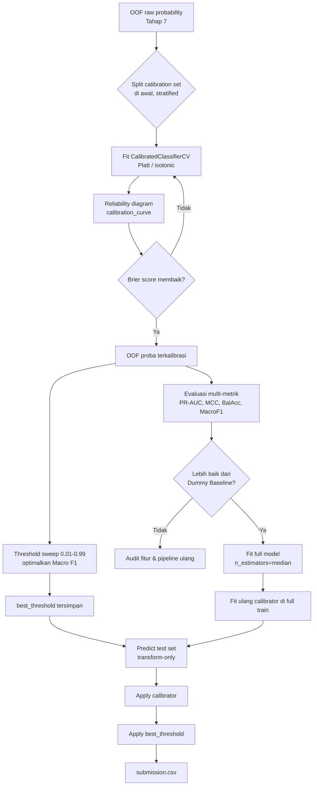
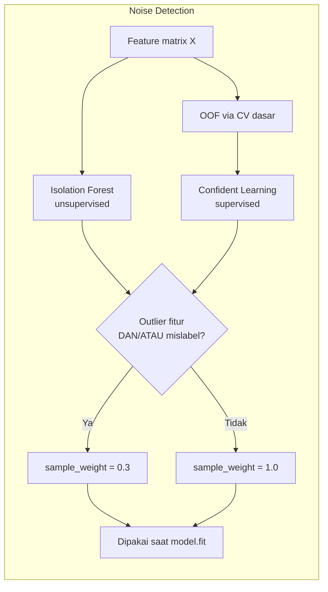

# 01_full_v1 — Prompt Implementasi untuk OpenCode

> **Cara pakai:** copy seluruh isi blok "PROMPT UNTUK OPENCODE" di bawah, paste ke opencode.
> Karena konteks opencode pendek, prompt ini sudah dibuat **self-contained** — semua parameter,
> alur data, dan skema file dijelaskan eksplisit, tidak bergantung pada opencode "menebak" apa pun.

---

## 0. Konteks singkat (untuk lo, bukan bagian prompt)

- Baseline lama: **accuracy/F1-macro cuma 0.52** (hampir setara dummy classifier → ada yang salah
  fundamental, bukan cuma soal tuning).
- Kemungkinan penyebab yang paling sering terjadi di kasus kayak gini: leakage terselubung (vectorizer
  di-fit ulang di test), noise label tidak ditangani, threshold di-fix 0.5 padahal imbalance,
  kalibrasi tidak dicek, atau fitur relasi/linguistik gagal jalan diam-diam (exception ditelan, fallback
  ke 0) sehingga fitur mahal itu sebenarnya tidak berkontribusi.
- Strategi di prompt ini: **frankenstein** — reuse fungsi preprocessing & feature extraction yang SUDAH
  jalan dari kode lama, tapi restructure ke `sklearn.Pipeline` + `ColumnTransformer` + custom
  `TransformerMixin` supaya modular, testable per-komponen, dan tidak ada tempat leakage bersembunyi.
- Semua langkah "info processing" (jumlah baris noise, threshold terpilih, parameter kalibrasi,
  n_estimators median, dsb) di-**persist ke JSON** supaya proses reproducible dan bisa diaudit tanpa
  re-run semua cell.

---

## 1. PROMPT UNTUK OPENCODE

```
KONTEKS PROYEK
==============
Ini adalah pipeline klasifikasi teks Bahasa Indonesia untuk deteksi HEADLINE vs ARTIKEL
mismatch (misalnya clickbait / headline tidak sesuai isi). Dataset: train.csv & test.csv,
kolom: headline (str), artikel (str), label (int, biner/multi — cek dulu di data aktual).

Attempt sebelumnya (kode lama di repo ini) hanya mencapai accuracy/F1-macro ~0.52 (setara
dummy baseline). Tugas lo BUKAN nulis dari nol, tapi:
1. Baca & audit kode lama di repo (cari file preprocessing/feature engineering yang sudah ada).
2. REUSE logika yang sudah benar (terutama regex cleaning, stopword list, fungsi Jaccard/overlap,
   dan feature yang murah), tapi BUNGKUS ulang jadi arsitektur modular (lihat Section 3).
3. AUDIT tiap fitur relasi/linguistik yang kompleks (dependency parsing, event extraction) —
   kalau ada try/except yang menelan error dan fallback ke 0/NaN, LAPORKAN dan JANGAN dibiarkan
   silent. Log ke JSON berapa persen baris yang gagal ekstraksi per fitur.
4. Cari leakage: pastikan TIDAK ADA vectorizer/scaler/SVD yang di-fit di test set atau di full
   data sebelum split. Ini kemungkinan besar penyebab skor 0.52.

Ikuti alur data & parameter berikut PERSIS (jangan improvisasi urutan tahap, boleh improvisasi
detail implementasi teknis selama urutan & kontrak data di bawah tetap dipegang):

===========================================================
TAHAP 0 — INPUT
===========================================================
- Load train.csv, test.csv. Kolom wajib: headline, artikel, label (label tidak ada di test).
- Validasi: cek missing value, duplikat, distribusi label (buat & simpan value_counts).

===========================================================
TAHAP 1 — PREPROCESSING (stateless, no re-fit, sama persis train & test)
===========================================================
Fungsi murni (input string -> output string), TIDAK BOLEH menyimpan state dari data:
1. normalize whitespace (collapse multiple space/newline jadi single space)
2. remove URL (regex http/https/www) dan HTML tags
3. remove noise (karakter non-alfanumerik berlebih, tapi PERTAHANKAN tanda baca yang
   dipakai fitur stylistik di Tahap 2, misal '!' — jadi buat 2 versi teks:
     - clean_a = versi untuk fitur stylistik (raw-ish, tanda baca dipertahankan)
     - clean_b = versi untuk fitur lexical (lowercase, stopword removed) <- ini yang di diagram
4. lowercase
5. stopword removal (pakai stoplist ID — reuse dari kode lama kalau ada, kalau tidak
   pakai daftar stopword Sastrawi/ID standar)
6. Tokenisasi pakai `spacy.blank("id")` (BUKAN model pretrained, cuma tokenizer + rule-based
   pipeline tambahan kalau perlu POS/dependency approksimasi manual — jelaskan di kode kalau
   spaCy blank tidak native support POS tagger bahasa Indonesia, jadi fitur POS-ratio dan
   dependency path di Tahap 2 mungkin perlu heuristik regex/wordlist based, BUKAN true parsing.
   Tulis komentar jujur di kode soal keterbatasan ini.)

Simpan hasil: df['clean_a'], df['clean_b'], df['tokens'] (list token) untuk headline & artikel
masing-masing (jadi 6 kolom turunan: headline_clean_a, headline_clean_b, headline_tokens,
artikel_clean_a, artikel_clean_b, artikel_tokens).

IMPLEMENTASI: bungkus sebagai satu class `TextPreprocessor(BaseEstimator, TransformerMixin)`
di sklearn Pipeline, method `.transform(X)` menerima DataFrame kolom [headline, artikel] dan
mengembalikan DataFrame dengan kolom turunan di atas. `.fit()` no-op (stateless).

===========================================================
TAHAP 2 — FEATURE EXTRACTION (semua transformer stateless ATAU fit hanya di train fold)
===========================================================
Buat SATU custom transformer per grup fitur, semua digabung lewat `FeatureUnion` atau
`ColumnTransformer`. Untuk transformer yang PUNYA state (TF-IDF, char_wb TF-IDF) —
fit HANYA di training fold saat CV, dan fit ulang di full train saat training final;
JANGAN PERNAH fit di test set (transform-only untuk test, pakai object yang sudah fit).

A. LEXICAL / STATISTICAL (stateful untuk TF-IDF, stateless untuk sisanya):
   - Jaccard similarity(headline_tokens, artikel_tokens)
   - overlap_coefficient(headline_tokens, artikel_tokens)
   - TF-IDF cosine similarity: fit TfidfVectorizer(ngram_range=(1,2), analyzer='word') di
     GABUNGAN clean_b headline+artikel train, lalu hitung cosine(tfidf(headline), tfidf(artikel))
     per baris
   - char_wb TF-IDF: TfidfVectorizer(analyzer='char_wb', ngram_range=(3,5)) — dipakai sebagai
     pengganti stemmer (menangkap morfologi ID tanpa perlu stemmer eksplisit), hitung cosine
     sim yang sama seperti di atas

B. ENTITY & NUMERIK (regex based, stateless):
   - proxy-NER: hitung kata berkapital (bukan di awal kalimat) di headline vs artikel,
     hitung intersection-nya (set kata kapital yang muncul di headline JUGA muncul di artikel)
   - regex angka: `\d+[.,]?\d*` — ekstrak semua angka di headline & artikel
   - regex tanggal/bulan/tahun (bikin regex daftar nama bulan ID + pattern DD/MM/YYYY dst)
   - numeric_mismatch_count = jumlah angka yang muncul di headline TAPI TIDAK ADA versi
     yang cocok (atau dalam toleransi) di artikel
   - entity_intersection_ratio = |proxy_entities(headline) ∩ proxy_entities(artikel)| /
     |proxy_entities(headline)|

C. POSISI / STRUKTUR (stateless):
   - lead_paragraph_match: skor kemunculan kata kunci headline (non-stopword) di N kalimat
     pertama artikel (misal N=3) dibanding kemunculan di keseluruhan artikel — rasio
     "early mention" vs "scattered"

D. LINGUISTIK (stateless, lexicon/rule based — declare limitasi):
   - sentiment_gap: |sentiment(headline) - sentiment(artikel)| pakai lexicon ID
     (kalau tidak ada lexicon AFINN/VADER ID di repo, buat wordlist sentimen ID minimal
     atau cari library `indonesia-sentiment-lexicon` yang tersedia offline; JANGAN
     hardcode API call ke internet)
   - superlative_ratio: hitung kemunculan kata superlatif ("terbesar","tergila","terheboh",
     dst — pakai wordlist, boleh reuse dari kode lama) / total kata di headline
   - discourse_markers: hitung kemunculan "tapi","namun","padahal","meskipun" DI ARTIKEL
     yang berdekatan (window ±1 kalimat) dengan kalimat yang overlap dengan headline
   - negation_scope: JANGAN cuma deteksi ada/tidaknya "tidak"/"bukan" — cari objek yang
     dinegasikan (token setelah kata negasi dalam window pendek, misal 3 token) dan cek
     apakah objek tsb juga muncul di headline TANPA negasi (indikasi kontradiksi)
   - readability_gap: |avg_sentence_length(headline) - avg_sentence_length(artikel)|,
     bisa tambah rasio panjang kata rata-rata

E. RELASI (spaCy blank "id" — CATAT LIMITASI, lihat Tahap 1):
   - event_extraction: ekstrak verba aksi di headline (pakai wordlist verba aksi ID atau
     heuristik akhiran "-kan"/"me-" dst kalau tidak ada POS tagger asli), cek co-occurrence
     verba tsb (atau sinonim sederhana) di kalimat-kalimat artikel
   - relation_extraction: karena spacy.blank("id") TIDAK punya dependency parser bawaan,
     implementasikan heuristik subjek-verb-objek sederhana berbasis urutan token + wordlist
     verba (bukan true dependency path). Beri nama fungsi yang jujur, misal
     `heuristic_svo_extraction()`, bukan `dependency_parse()`, supaya tidak menyesatkan.
   - Bandingkan SVO headline vs SVO artikel, hasilkan skor overlap 0-1

F. STYLISTIK (stateless, murah, opsional — pakai clean_a bukan clean_b karena butuh tanda baca):
   - jumlah tanda seru di headline
   - rasio huruf kapital berlebihan (ALL CAPS words / total words)
   - deteksi kata "VIRAL","HEBOH","GEGER", dll (wordlist, case-insensitive)

OUTPUT TAHAP 2: matrix fitur X (semua grup A-F digabung jadi satu array/DataFrame numerik),
DAN simpan `feature_names` (list nama kolom fitur final, urut) ke JSON (lihat Section 2 di
bawah — logging_schema).

IMPLEMENTASI: setiap grup A-F = 1 class transformer terpisah (misal `LexicalFeatures`,
`EntityNumericFeatures`, `PositionFeatures`, `LinguisticFeatures`, `RelationFeatures`,
`StylisticFeatures`), semua turunan `BaseEstimator, TransformerMixin`, digabung via
`FeatureUnion([...])` atau `ColumnTransformer` dalam SATU `Pipeline` bernama
`feature_pipeline`. Ini WAJIB supaya nanti `feature_pipeline.fit(X_train)` lalu
`feature_pipeline.transform(X_test)` otomatis mencegah leakage tanpa perlu diingat manual.

===========================================================
TAHAP 3 — DUMMY BASELINE
===========================================================
- `DummyClassifier(strategy='most_frequent')`, fit di train, evaluasi dengan metrik yang
  SAMA seperti Tahap 9 (PR-AUC, MCC, Balanced Accuracy, Macro F1). Simpan angka ini sebagai
  patokan minimum di JSON — SEMUA model wajib dibandingkan ke sini di laporan akhir.

===========================================================
TAHAP 4 — NOISE / LABEL QUALITY CHECK
===========================================================
- Isolation Forest (unsupervised, hanya lihat fitur X, TIDAK lihat label) → deteksi baris
  outlier fitur, simpan `outlier_score` per baris.
- Confident Learning via Out-of-Fold predictions (supervised): gunakan `cleanlab` kalau
  tersedia (`pip install cleanlab`), atau implementasi manual: latih model dasar dengan
  CV, kumpulkan OOF predicted probability, tandai baris dengan predicted label confidence
  tinggi TAPI beda dari label asli sebagai kandidat mislabel.
- Assign `sample_weight`: baris "bersih" = 1.0, baris "noise" (terdeteksi salah satu atau
  kedua metode di atas, tentukan threshold eksplisit dan JELASKAN di komentar kode
  kriteria "noise" itu apa persisnya, misal isolation_forest outlier DAN confident-learning
  flag) = 0.3.
- Simpan ke JSON: jumlah baris noise, threshold yang dipakai, contoh index baris noise.

===========================================================
TAHAP 5 — NESTED STRATIFIED K-FOLD CV
===========================================================
- Outer: `StratifiedKFold(n_splits=5, shuffle=True, random_state=42)` — fold ini untuk
  EVALUASI FINAL per fold, tidak boleh dipakai untuk tuning apa pun.
- Inner (di dalam tiap outer train fold): split lagi (misal `train_test_split` 85/15 atau
  StratifiedKFold n_splits=3) HANYA untuk early stopping n_estimators — model dilatih
  dengan eval_set dari inner split, ambil `best_iteration`.
- SEMUA fitting object stateful (TF-IDF, scaler, dsb dari `feature_pipeline`) di-fit ULANG
  di setiap outer train fold (jangan fit sekali di awal lalu dipakai untuk semua fold —
  itu leakage).
- sample_weight dari Tahap 4 dipakai saat `.fit()` model di tiap fold.

===========================================================
TAHAP 6 — MODEL TRAINING (per outer fold)
===========================================================
- Model: XGBoost (`XGBClassifier`) ATAU LightGBM (`LGBMClassifier`) — pilih salah satu
  sebagai primary, tapi buat kode modular supaya gampang switch (dependency injection
  lewat config, bukan hardcode).
- `scale_pos_weight = 1.0` (imbalance SENGAJA tidak ditangani di level ini — akan
  ditangani di Tahap 11 lewat threshold tuning, JANGAN set scale_pos_weight otomatis).
- early_stopping pakai inner split dari Tahap 5, simpan `best_iteration` tiap outer fold.
- Simpan model per fold (untuk audit) + OOF raw probability prediction.

===========================================================
TAHAP 7 — OOF PREDICTIONS
===========================================================
- Kumpulkan raw probability (belum dikalibrasi, belum threshold) dari tiap outer fold
  jadi satu array OOF proba untuk SELURUH train set (tiap baris diprediksi oleh model
  yang TIDAK dilatih dengan baris itu).

===========================================================
TAHAP 8 — PROBABILITY CALIBRATION
===========================================================
- Split calibration set DI AWAL (sebelum Tahap 5 dimulai, sisihkan misal 15% dari train
  dengan stratified split, simpan index-nya) — supaya tidak overlap dengan CV manapun.
- Platt scaling (`sklearn.calibration.CalibratedClassifierCV` method='sigmoid') ATAU
  isotonic — fit di calibration set, transform proba dari Tahap 7 (untuk baris di luar
  calibration set) dan proba model final nanti (Tahap 12) untuk test set.

===========================================================
TAHAP 9 — RELIABILITY DIAGRAM CHECK
===========================================================
- Plot mean predicted probability (dibagi bins, misal 10 bins) vs fraction of positives
  aktual di tiap bin (pakai `sklearn.calibration.calibration_curve`).
- WAJIB simpan sebagai gambar/artifact + Brier score sebelum & sesudah kalibrasi ke JSON,
  supaya tidak "percaya proses" tapi benar-benar diverifikasi angkanya membaik.

===========================================================
TAHAP 10 — EVALUASI MULTI-METRIK
===========================================================
Hitung SEMUA metrik berikut pada OOF (setelah kalibrasi) dan bandingkan ke Dummy Baseline
Tahap 3:
- PR-AUC (`average_precision_score`)
- MCC (`matthews_corrcoef`)
- Balanced Accuracy
- Macro F1 (`f1_score(average='macro')`) <- METRIK UTAMA kompetisi/tugas ini
JANGAN laporkan accuracy atau ROC-AUC sebagai metrik utama (imbalance membuat keduanya
menyesatkan) — boleh ditampilkan sebagai info tambahan saja, JELASKAN di output kenapa.

===========================================================
TAHAP 11 — THRESHOLD TUNING
===========================================================
- Sweep threshold 0.01 s.d. 0.99 (step 0.01) pada OOF proba (setelah kalibrasi).
- Optimalkan Macro F1 (bukan accuracy). Simpan kurva threshold vs Macro F1.
- Threshold terbaik = titik ini yang menangani class imbalance (BUKAN scale_pos_weight
  di Tahap 6). Simpan `best_threshold` ke JSON.

===========================================================
TAHAP 12 — FIT FULL MODEL
===========================================================
- Fit ulang `feature_pipeline` di SELURUH train (bukan per fold lagi).
- Fit model final dengan `n_estimators = median(best_iteration)` dari semua outer fold
  Tahap 6 (JELASKAN kenapa median, bukan mean — lebih robust ke outlier fold).
- Fit ulang calibrator (Tahap 8) juga di seluruh train (atau tetap pakai calibration set
  yang sama, JELASKAN pilihan mana yang diambil di komentar kode + kenapa).

===========================================================
TAHAP 13 — TEST SET
===========================================================
- Preprocessing (Tahap 1) & feature extraction (Tahap 2) PERSIS SAMA — panggil
  `feature_pipeline.transform(test_df)` (TRANSFORM ONLY, objek sudah di-fit dari Tahap 12,
  JANGAN fit ulang apapun di sini — ini poin paling kritis untuk mencegah bug leakage
  yang mirip penyebab skor 0.52 sebelumnya).

===========================================================
TAHAP 14 — PREDICT + SUBMISSION
===========================================================
- Predict proba test, apply calibrator dari Tahap 12, apply `best_threshold` dari Tahap 11.
- Simpan `submission.csv` (format kolom sesuai contoh submission kalau ada di repo, cek dulu).

===========================================================
OUTPUT WAJIB DARI OPENCODE
===========================================================
1. Kode modular (sklearn Pipeline based) sesuai Tahap 1-14 di atas, terpisah per file/module
   yang masuk akal (misal `preprocessing.py`, `features.py`, `noise_detection.py`,
   `train.py`, `calibrate.py`, `evaluate.py`, `predict.py`) ATAU satu notebook terstruktur
   per section kalau repo ini berbasis notebook — SESUAIKAN dengan struktur repo yang ADA,
   jangan bikin struktur baru yang bentrok.
2. Satu file `run_log.json` yang menyimpan SEMUA "processing info" sesuai skema di
   Section 2 (logging_schema) di bawah — WAJIB, ini yang membedakan run kali ini dengan
   attempt lama yang tidak bisa diaudit.
3. Diagram (boleh mermaid di markdown, atau matplotlib) untuk:
   a. Reliability diagram (Tahap 9)
   b. Kurva threshold vs Macro F1 (Tahap 11)
   c. Confusion matrix final (test kalau ada label, atau OOF)
   d. Feature importance (top-20) dari model final
4. Ringkasan akhir yang membandingkan skor lama (0.52) vs skor baru per metrik di Section
   Tahap 10, dalam bentuk tabel.

ATURAN KERAS:
- JANGAN fit vectorizer/scaler/SVD/apapun yang stateful di luar train fold masing-masing.
- JANGAN silent-fail: setiap try/except di fitur kompleks (Tahap 2E) WAJIB log persentase
  kegagalan ke run_log.json, bukan cuma fallback diam-diam.
- JANGAN ganti urutan tahap di atas. Kalau ada keterbatasan teknis (misal spaCy blank
  tidak bisa true dependency parsing), implementasikan heuristik JUJUR dan CATAT
  limitasinya di komentar kode + run_log.json, jangan pura-pura itu true NLP parsing.
```

---

## 2. Skema JSON logging (`run_log.json`)

Sertakan bagian ini juga ke opencode (bisa ditempel setelah prompt di atas, atau sebagai
lampiran terpisah) supaya struktur JSON tidak ambigu:

```json
{
  "run_id": "string, contoh: v1_2026-09-04",
  "data": {
    "n_train": 0,
    "n_test": 0,
    "label_distribution": {"0": 0, "1": 0},
    "missing_values": {}
  },
  "preprocessing": {
    "stopword_source": "string",
    "spacy_pipeline": "spacy.blank('id') + custom rules",
    "limitations": ["spaCy blank tidak punya POS/dependency parser native untuk id, ..."]
  },
  "features": {
    "feature_names": ["list", "semua", "nama", "kolom", "fitur"],
    "n_features": 0,
    "tfidf_word_vocab_size": 0,
    "tfidf_charwb_vocab_size": 0,
    "extraction_failure_rate": {
      "event_extraction": 0.0,
      "relation_extraction": 0.0,
      "sentiment_gap": 0.0
    }
  },
  "dummy_baseline": {
    "pr_auc": 0.0, "mcc": 0.0, "balanced_accuracy": 0.0, "macro_f1": 0.0
  },
  "noise_detection": {
    "isolation_forest_contamination": 0.0,
    "n_noise_rows": 0,
    "noise_criteria": "string, jelaskan kriteria persis",
    "sample_weight_clean": 1.0,
    "sample_weight_noise": 0.3
  },
  "cv": {
    "outer_n_splits": 5,
    "inner_strategy": "string",
    "best_iteration_per_fold": [0, 0, 0, 0, 0],
    "median_best_iteration": 0
  },
  "model": {
    "type": "xgboost | lightgbm",
    "params": {},
    "scale_pos_weight": 1.0
  },
  "calibration": {
    "method": "sigmoid | isotonic",
    "calibration_set_size": 0,
    "brier_score_before": 0.0,
    "brier_score_after": 0.0
  },
  "threshold_tuning": {
    "best_threshold": 0.0,
    "macro_f1_at_best_threshold": 0.0,
    "sweep_range": [0.01, 0.99]
  },
  "evaluation_oof": {
    "pr_auc": 0.0, "mcc": 0.0, "balanced_accuracy": 0.0, "macro_f1": 0.0
  },
  "comparison_to_previous_attempt": {
    "previous_macro_f1": 0.52,
    "previous_accuracy": 0.52,
    "new_macro_f1": 0.0,
    "improvement": 0.0
  }
}
```

---

## 3. Diagram tambahan — alur SETELAH feature extraction

Diagram utama lo (Tahap 0-2) sudah lengkap. Berikut diagram tambahan khusus untuk bagian
**post-processing** (Tahap 8-14) supaya lebih jelas urutan kalibrasi → threshold → predict:





---

## 4. Checklist verifikasi sebelum lo submit prompt ke opencode

- [ ] Sudah cek struktur repo aktual (notebook vs .py modules) — sesuaikan instruksi Section 1
      poin "OUTPUT WAJIB" biar opencode tidak bikin struktur baru yang bentrok.
- [ ] Sudah pastikan `label` di data itu biner atau multi-class (mempengaruhi cara Macro F1
      dan scale_pos_weight dihitung — kalau multi-class, scale_pos_weight tidak relevan,
      ganti ke `class_weight` atau sample_weight murni).
- [ ] Sudah tahu kolom submission format yang diminta (kalau ada `sample_submission.csv` di
      repo, sebutkan eksplisit ke opencode).
- [ ] Cek apakah `cleanlab` boleh diinstall (kalau environment offline/restricted, ganti ke
      implementasi manual confident learning).